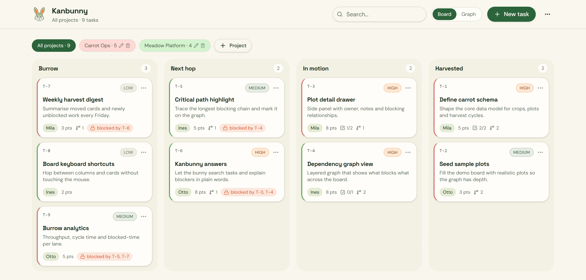

# Kanbunny Board

A mini kanban board with dependency graphs — lanes, blocking relationships, and a layered graph of
what blocks what.



## How it was built

- **The look and feel is [Lovable](https://lovable.dev)'s** — the design system in `src/styles.css`
  (the oklch palette, Space Grotesk / DM Sans, the lane and card styling), the shadcn/ui component
  set, and the app's framework: TanStack Start via `@lovable.dev/vite-tanstack-config`. That visual
  identity is deliberately preserved, not redesigned.
- **Everything else was built with [Claude Code](https://claude.com/claude-code)** — moving the app
  into `frontend/`, dropping the server so it runs client-only, the mock data layer, the board
  interactions (create, edit, delete, drag-and-drop, keyboard shortcuts, search, the dependency
  graph and critical path), and the tests.

## Where things are

```
frontend/     the web UI — React 19, TanStack Start (SPA mode), Tailwind 4, shadcn/ui
backend/      the API — FastAPI, managed with uv, in-memory store
openapi.yaml  the contract both sides are built against
_docs/        specs.md, the normative specification
```

## Two ways to run it

**Demo mode (default).** The frontend serves itself mock data from memory. No backend, no
database, no sign-in — open it and the board is there. Changes vanish on reload.

**Connected mode.** The frontend calls the FastAPI backend, which persists to SQLite and requires
you to sign in. Set `VITE_API_MODE=http` in `frontend/.env`.

Each side has its own switch, and they are independent:

| | Flag | Demo | Real |
|---|---|---|---|
| frontend | `VITE_API_MODE` | `mock` | `http` |
| backend | `KANBUNNY_STORE` | `memory` | `database` |

Both default files are checked in as `.env.example` — copy to `.env` and edit.

## Running it

### Frontend — needs [bun](https://bun.sh)

```sh
cd frontend
bun install
bun run dev
```

Then open **http://localhost:8080** (Vite picks the next free port — 8081, 8082 — if that one is
already taken; the terminal prints the URL it chose). `Ctrl+C` stops it.

The rest, all from `frontend/`:

```sh
bun run build     # static build — nothing needs to run on a server
bun run preview
bun run test      # vitest: the pure queries and the mock API
bun run lint
```

Use `bun run test`, not `bun test` — the suite is written for vitest, and `bun test` is bun's own
runner.

### Backend — needs [uv](https://docs.astral.sh/uv/)

```sh
cd backend
uv sync
uv run uvicorn app.main:app --reload --port 8000
```

Docs at <http://localhost:8000/docs>, tests with `uv run pytest`. It writes to
`backend/kanbunny.db` unless `DATABASE_URL` says otherwise. See
[`backend/README.md`](backend/README.md).

### Both together

Start the backend, then the frontend with `VITE_API_MODE=http` in `frontend/.env`, and sign in as
**`mila`** / **`carrots123`**.

## A note on CORS, since it trips everyone up

Browsers refuse to let a page read a response from a *different origin* than the page itself —
different scheme, host or port all count. The page at `localhost:8080` asking `localhost:8000` for
data is cross-origin, and the browser blocks it unless the server explicitly says that origin is
allowed. That permission is CORS.

**The setup here sidesteps it entirely.** The frontend calls `/api/tasks` — a relative path, so the
browser sends it to `localhost:8080`, its own origin, and never objects. Vite is configured to
forward anything starting with `/api` to `localhost:8000`. The forwarding happens in Vite, not the
browser, and CORS only governs browsers. So in development there is nothing to configure and
nothing to go wrong.

It only becomes real when the frontend is deployed somewhere and calls the API by its full URL. Then
the request genuinely is cross-origin, and the backend's `KANBUNNY_CORS_ORIGINS` has to list the
site's origin. If you ever see "blocked by CORS policy" in the console, that is the browser saying
the server did not name your origin — it is a server configuration answer, never something you can
fix in the frontend.

> `bunfig.toml` sets `minimumReleaseAge = 86400`, so bun refuses package versions published in the
> last 24 hours. If an install fails on a brand-new release, that is why.

## Using the board

- **Drag** a card between lanes, or use the `⋯` menu on any card — which is also the only way on
  touch, since HTML5 drag events do not fire there.
- **Keyboard**: press `?` for the full list.
  `j` `k` `h` `l` or the arrows move focus, `1`–`4` send the focused card to a lane,
  `⇧←` `⇧→` nudge it one lane, `n` creates, `e` edits, `/` searches, `b` and `g` switch
  board and graph.
- **Graph** view maps the blocking chain; *Critical path* highlights the longest one.
- Tasks can wait on other tasks. A dependency that would create a **loop** is refused, in the
  dialog and in the API.

## Lanes

**Burrow** → **Next hop** → **In motion** → **Harvested**
